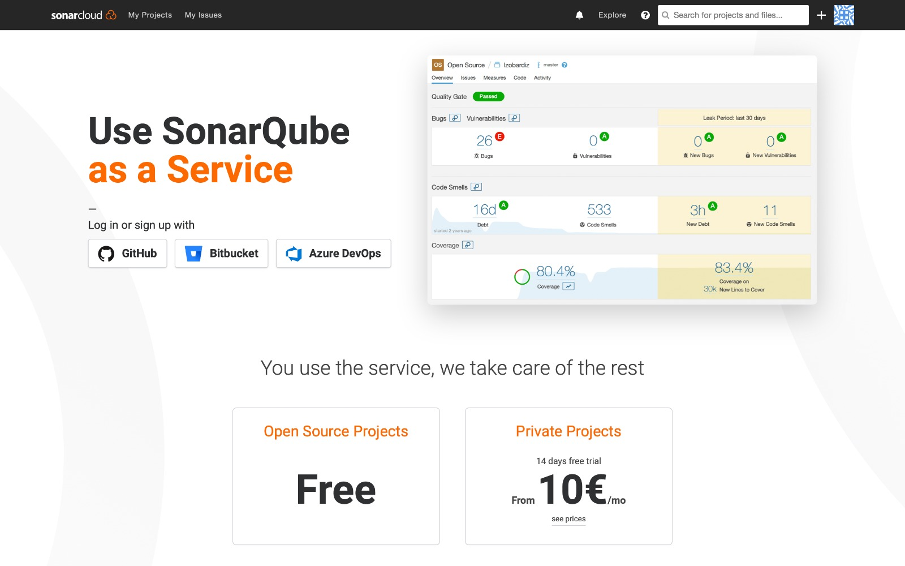
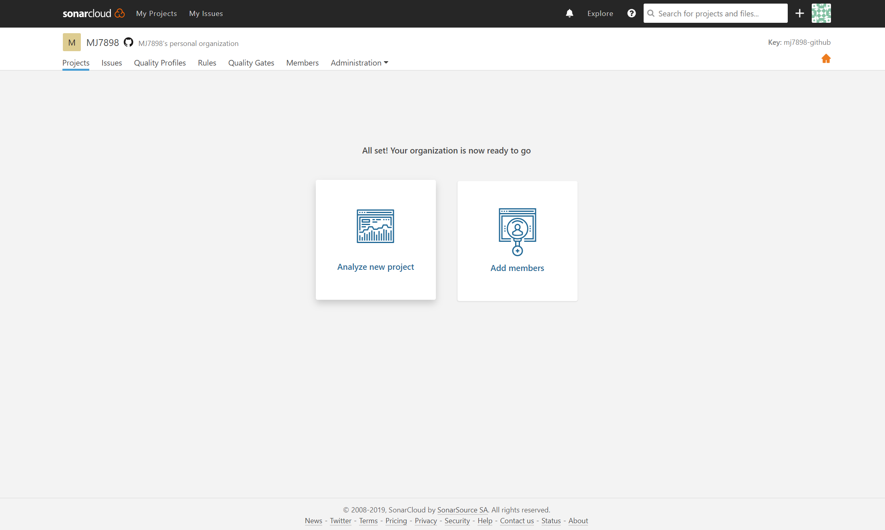
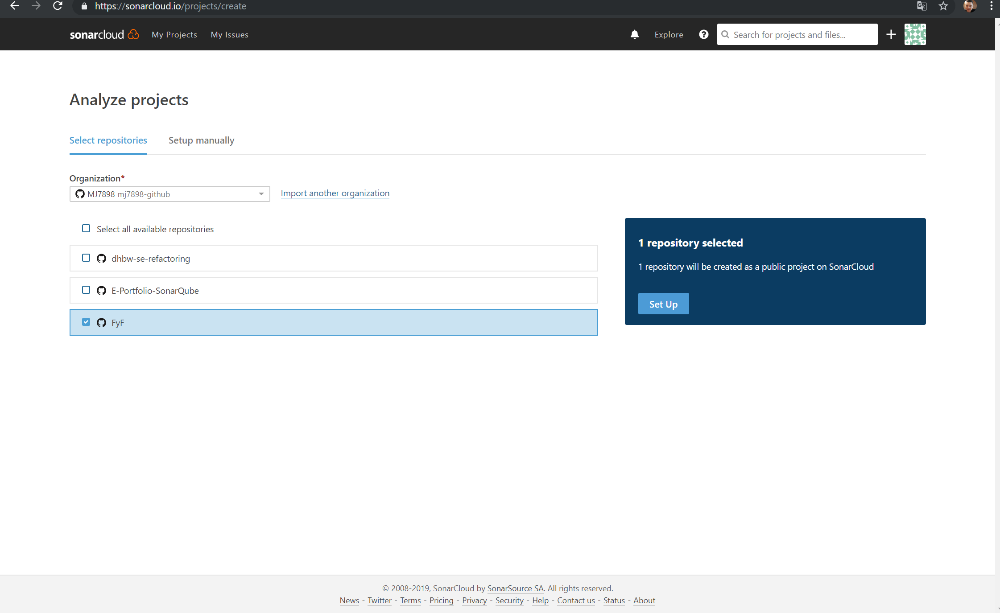
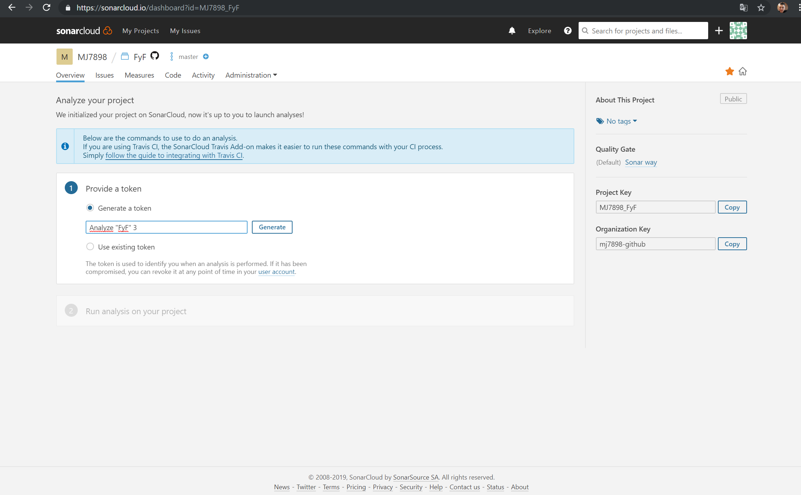
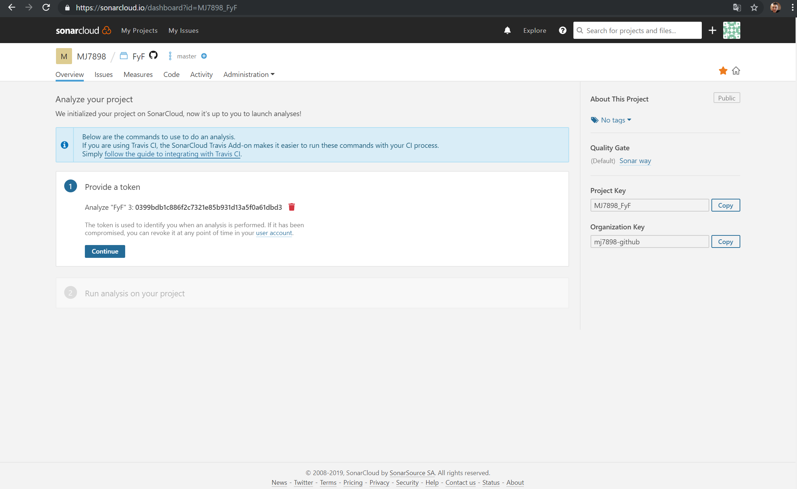
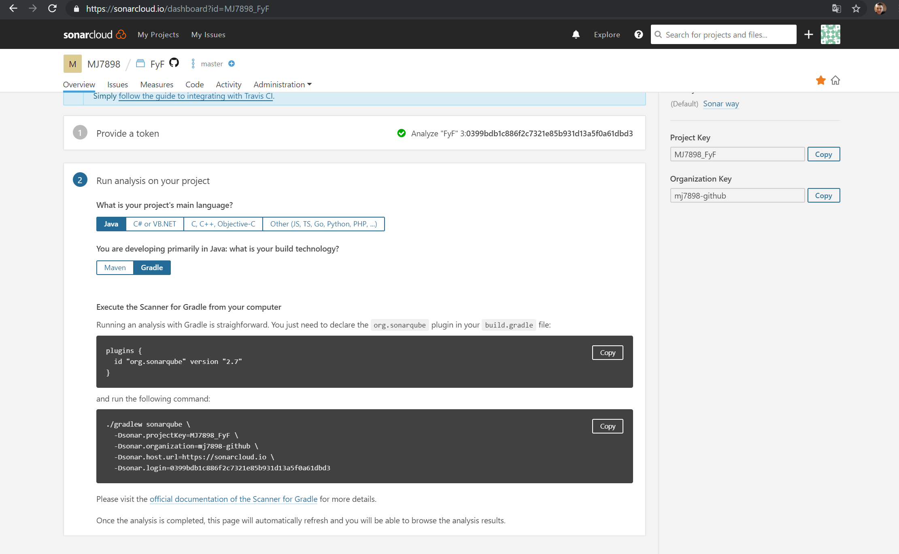

# E-Portfolio-SonarQube

Here are all informations about the e-portfolio, some exercises and solutions of them.

# Sonarqube / Sonarcloud Hands-on:

It will run on all devices and all IDE´s.

## Content:

Follow the instruction

Content:
- [1. Login to sonarcloud with github account](#1-login-to-sonarcloud-with-github-account)
- [2. Fork the project](#2-fork-the-project)
- [3. On sonarcloud select the repository you will check with sonarqube](#3-on-sonarcloud-select-the-repository-you-will-check-with-sonarqube)
- [4. Setup the join between IDE and sonarcloud](#4-setup-the-join-between-IDE-and-sonarcloud)
- [5. See what your code is about](#5-see-what-your-code-is-about)

So after this steps you can handle your code quality and see what you can do better or what is almost good.

# 1. Login to sonarcloud.io with github account

Here you can find sonarcloud. https://sonarcloud.io/ 
To use sonarcloud, you can take your github account to link it with sonarcloud. 

In our case just click the link to github to get access.

# 2. fork the project

If the repository or project is not yours, fork it in your account to have all permissions and continue the steps in sonarcloud.

# 3. select the right repository

When you see the following picture, click to "Analyze new Project" 

After that you will come to the page of selecting the Repository you would like to analyze.

If you have checked the repository, click on the right Set Up button to continue the steps. 

# 4 follow the instruction of sonarcloud

In the following picture you can see how to make the analyzation running. 

Now you generate an Token to identify your repository of analyzation.

After that you have to guess which components your project have. (programming language, or build type)

Go to your IDE.
Then you need to add the plugin line to your global gradle, if you use gradle. With maven just use the other option.

After that, run the other lines on the terminal in your IDE, go back to the website of sonarcloud.
That's it. 

# 5. Finally
Now you can see how your code quality is, also you can see things you have to prepare.

